# Proyecto ORM
  
#### Hecho por Ángel Gómez Prol  2ºDAM
#### 2023-2024
## Descripción
El proyecto consiste en una aplicación de escritorio que permite gestionar un carrito de la compra de una tienda online. 
La aplicación está desarrollada en Java, usando el framework JavaFX para crear la interfaz gráfica de usuario.  
La aplicación se conecta a una base de datos embebida H2, que almacena los datos de los productos, los clientes y 
los pedidos. Para acceder a la base de datos, la aplicación usa el estándar JPA (Java Persistence API) y la 
implementación Hibernate, que facilitan el mapeo entre las clases de entidad y las tablas de la base de datos.  
La aplicación usa el patrón DAO (Data Access Object) para encapsular las operaciones de acceso a datos, y el patrón 
DTO (Data Transfer Object) para transferir los datos entre las capas de la aplicación. La aplicación permite al usuario 
realizar las siguientes acciones:

- Ver el catalogo de productos de la tienda.
- Editar los productos del catalogo de la tienda.
- Añadir productos nuevos al catalogo.
- Eliminar productos del carrito de la compra.
- Ver el historial de pedidos realizados por un cliente.
- Realizar un pedido de un producto, indicando quien lo hace y cuantos productos se quieren.

## Diagrama de Base de Datos para Comercio Electrónico  
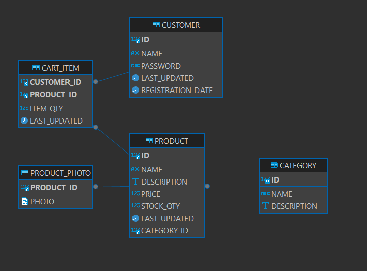  
### Tablas:   

1. **PRODUCT**: Representa los productos disponibles en la tienda en línea. Contiene atributos como `product_id`,`name`, `description`, `price`, y `stock_quantity`.

2. **CATEGORY**: Almacena las categorías a las que pertenecen los productos. Tiene campos como `category_id` y `category_name`.

3. **CART_ITEM**: Registra los elementos seleccionados por los clientes en su carrito de compras. Incluye atributos como `cart_item_id`, `product_id`, `quantity`, y `total_price`.

4. **CUSTOMER**: Mantiene información sobre los clientes registrados. Contiene campos como `customer_id`, `first_name`, `last_name`, `email`, y `shipping_address`.
5. **PRODUCT_PHOTO**: Almacena las fotos de los productos. Contiene campos como `product_id`  y `photo`.


### **Relaciones:**

- **PRODUCT** y **CATEGORY**: Relación de muchos a uno. Un producto puede pertenecer a una sola categoría, pero una 
- categoría puede tener varios productos.

- **CART_ITEM** y **PRODUCT**: Relación de muchos a uno. Un elemento del carrito está asociado a un único producto.

- **CART_ITEM** y **CUSTOMER**: Relación de muchos a uno. Un elemento del carrito pertenece a un cliente específico.

- **PRODUCT_PHOTO** y **PRODUCT**: Relación de uno a uno. Cada producto puede tener una sola foto

### **Posibles Funcionalidades Adicionales:**

- **Descuentos y Promociones**: Se podrían implementar tablas adicionales para gestionar descuentos, cupones y 
- promociones aplicables a los productos.

- **Seguridad y Autenticación**: Para proteger los datos de los clientes, se podría incorporar una tabla para almacenar 
- credenciales de inicio de sesión y roles de usuario.

Este diseño de base de datos proporciona una estructura sólida para una plataforma de comercio electrónico, permitiendo 
la gestión eficiente de productos, pedidos y clientes.

## GUI
La interfaz gráfica de usuario (GUI) de la aplicación de escritorio se ha desarrollado con JavaFX, un conjunto 
de herramientas y bibliotecas para crear aplicaciones de escritorio modernas y atractivas.

### **Ventana Principal:**
La ventana principal de la aplicación muestra el catálogo de productos de la tienda, con la opción de ver detalles
dependiendo de su categoría con tan solo posicionar el ratón encima del producto.  

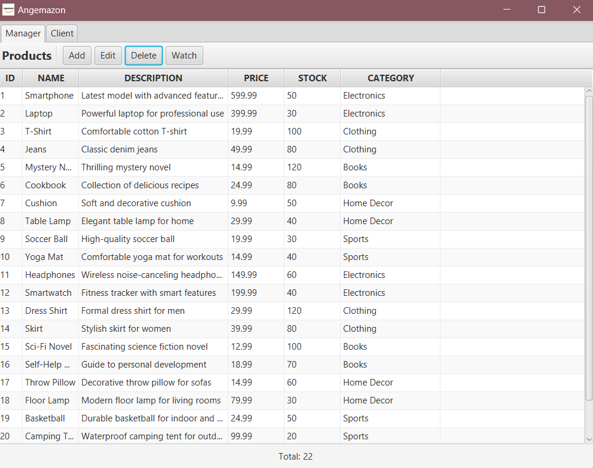
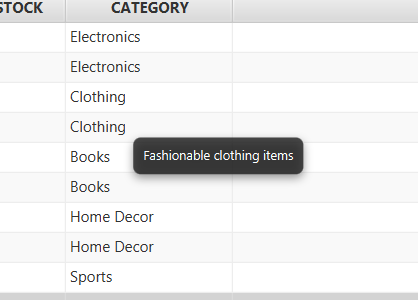  

Podemos realizar distintas acciones como añadir productos al carrito, eliminar productos del carrito o editar 
los existentes:  


> Añadir producto:
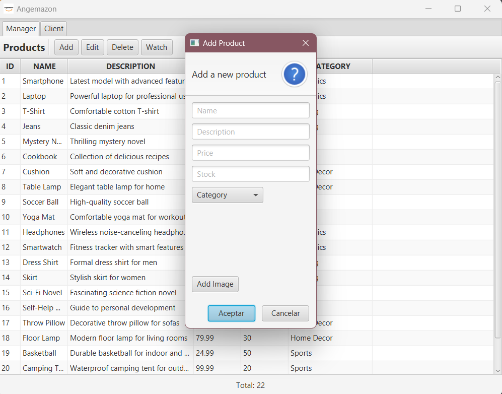  
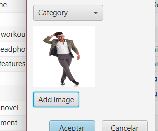

> Editar producto:
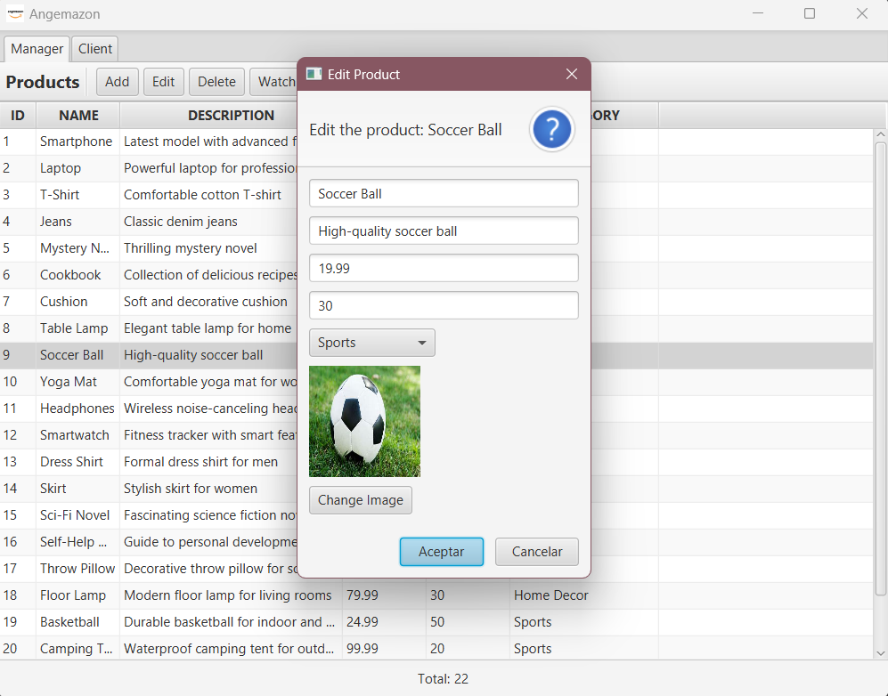  

> Eliminar producto
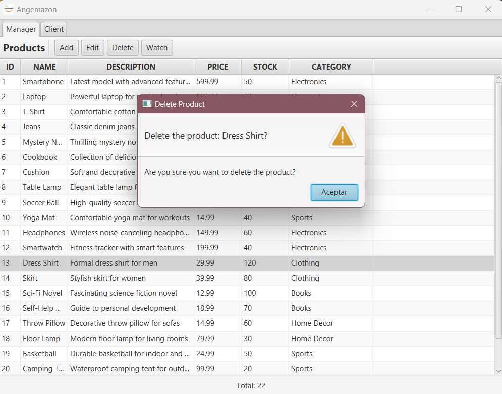

> Ver Producto
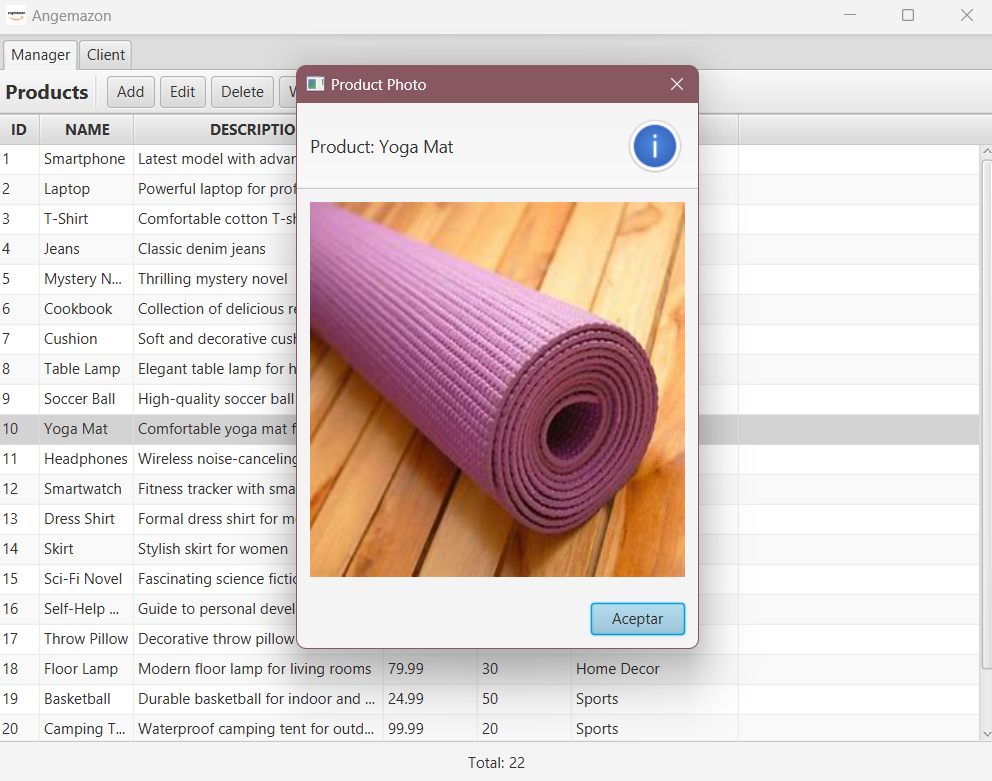

### **Ventana de historial de compras:**
La ventana de historial de compras muestra los pedidos realizados por un cliente específico. Podemos acceder de manera
sencilla con tan solo pulsar la pestaña de cliente.  
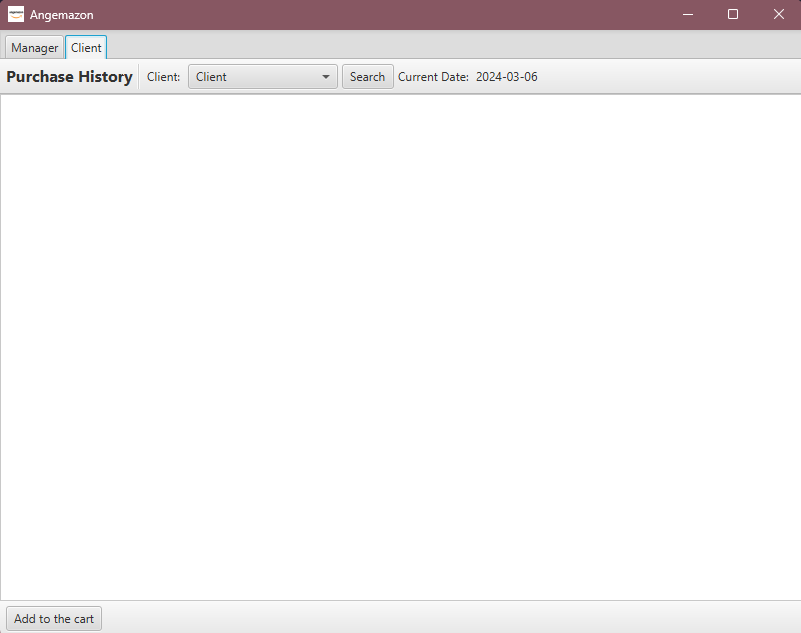  

Desde aquí podemos ver los pedidos realizados por el cliente, así como la fecha y el precio de la compra.  


> Seleccion de cliente
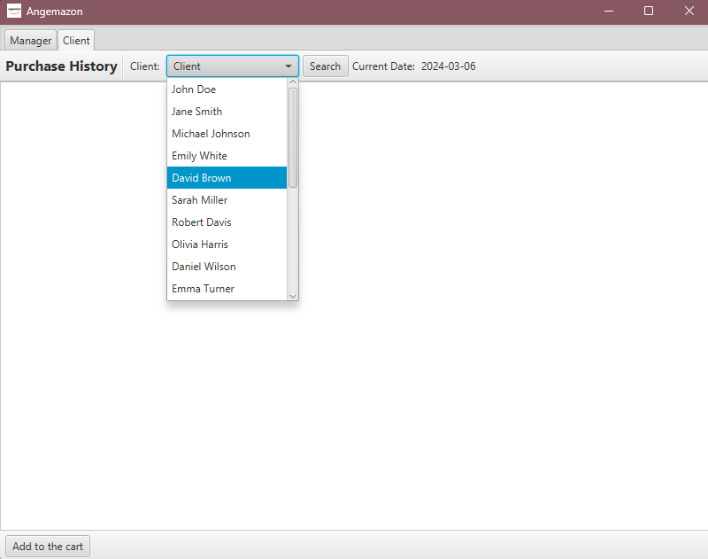  

> Historial de compras del cliente:
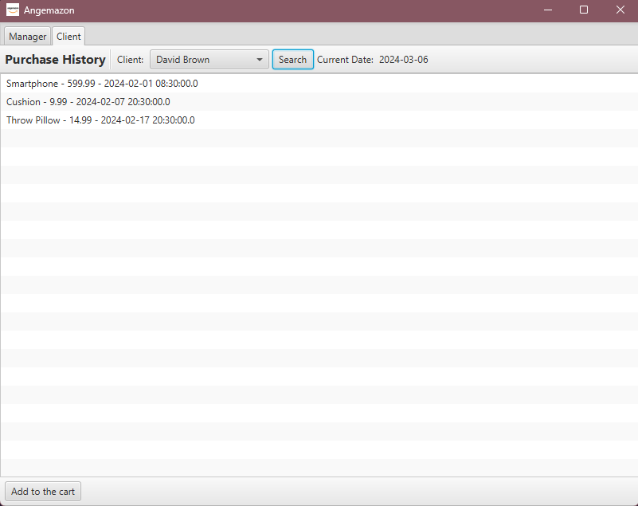

> Posibilidad de realizar un pedido para ese cliente:
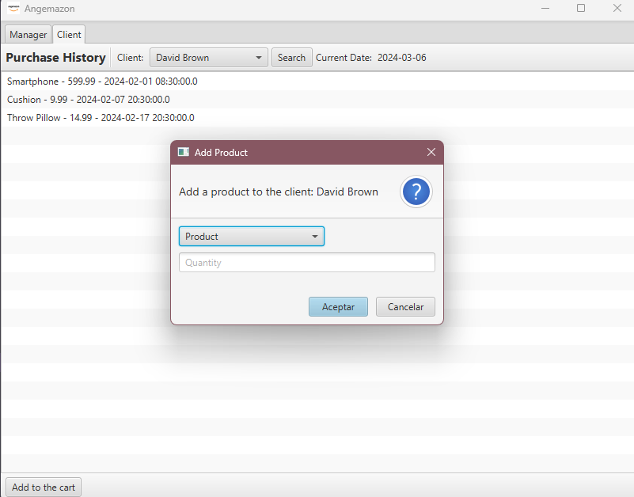

> Realizar pedido para el cliente seleccionado: 
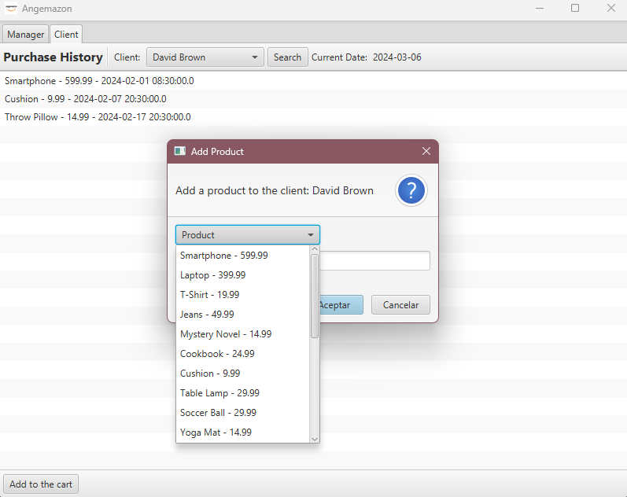  


## **Instalación y Configuración:**

Debido al espacio de almacenamiento, la base de datos se descarga desde:   

[Descargar Base de Datos y Código SQL](https://drive.google.com/file/d/176MF68O3Iw7mfduDsrWFWsTgxjWdQADd/view?usp=sharing)  

Para ejecutar la aplicación, es tan solo necesario modificar la ruta  de  la base de datos en el archivo `persistence.xml`
y ejecutar el archivo `CartApplication.java` que se encuentra en el paquete `agp/sanclemen/agp_proyecto/view/CartApplication.java`.
  
```xml
<property name="javax.persistence.jdbc.url" value="jdbc:h2:file:./src/main/resources/DB/cart_db"/>
```


